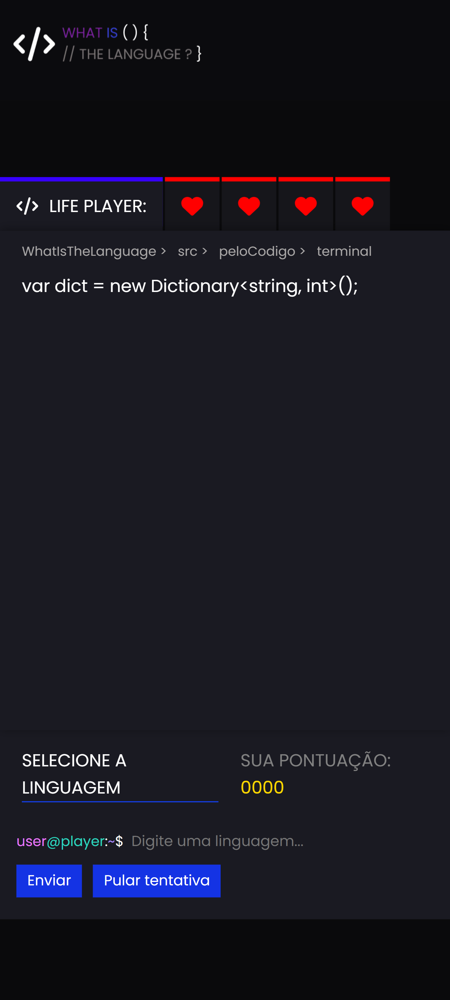
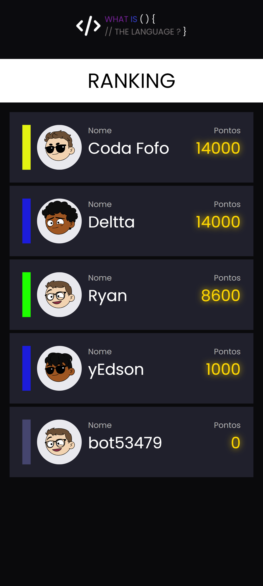
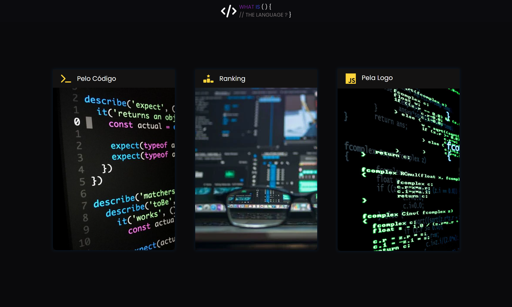
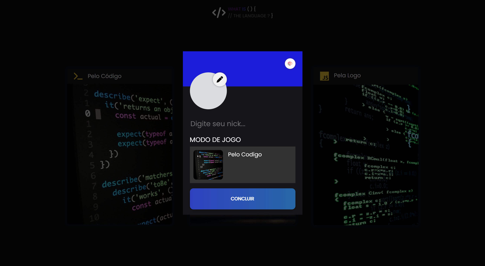
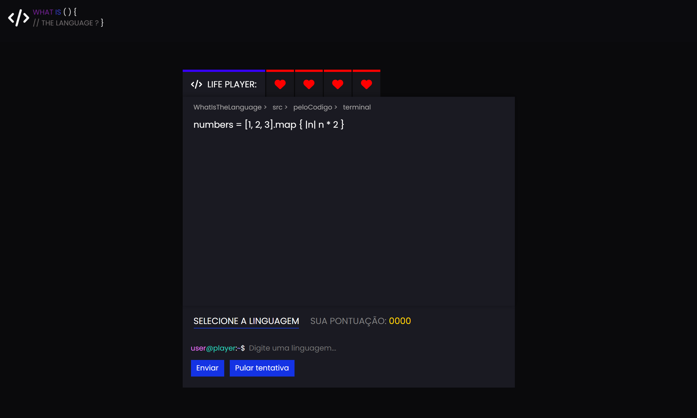
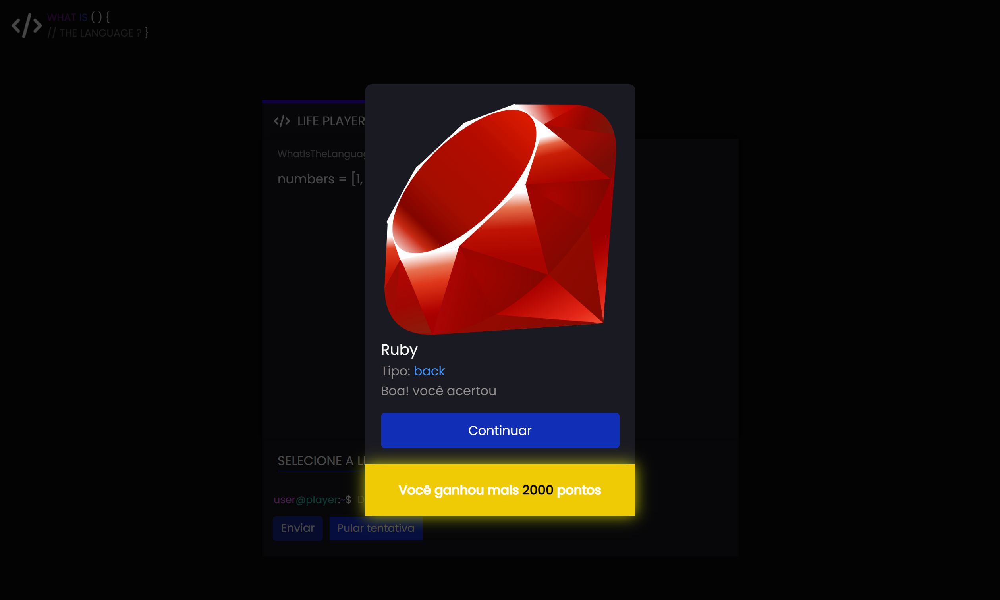
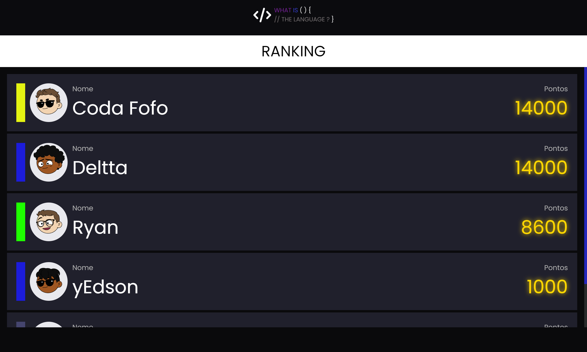

# </> What Is The Language?
<div align="center">


</div>

Um projeto Full-Stack desenvolvido na avaliação de Desenvolvimento Web, com o tema livre, decidi criar um site Game interativo e divertido de advinhar linguagens de programação. Como inspiração usei o site [Gamedle](https://www.gamedle.wtf).

## </> Topicos

- [Descrição do Projeto](#descrição-do-projeto)
- [Screenshots Do Projeto](#screenshots-do-projeto)
- [Tecnologias Utilizadas](#tecnologias-utilizadas)
- [Endpoints da API](#endpoints-da-api)
- [Como Executar o Projeto Localmente](#como-executar-o-projeto-localmente)
- [Licença](#licença)
- [Contato](#contato)

## </> Descrição do Projeto

O **What Is The Language**  ou **WITL** é um site Game onde o usuário advinha qual é a linguagem de progamação através de dicas, o usuário pode escolher entre 2 modos de jogo, **Advinhe Pela Logo** ou **Advinhe Pelo Código**, ambos os modos possuem sistemas de pontos e vidas, o usuário ganha pontos por acertar a advinhar a linguagem e perde vidas toda vez que erra. O jogo encerra quando o usuário perder todas as vidas ou acertando todas as linguagens, após isso aparecerá uma tela **Ranking** de todos os jogadores com seus nomes e suas pontuações.

## </> Screenshots Do Projeto
**Screenshots Mobile - (Clique nas imagens para amplia-las)**

<div class="mobile">
  
  
  
  
  
</div>

**Screenshots Desktop - (Clique nas imagens para amplia-las)**

<div class="desktop">
  
  
  
  
  
</div>


## </> Tecnologias Utilizadas

- **Frontend**:

  [](https://skillicons.dev)

- **Backend**:
  
  [](https://skillicons.dev)

- **APIs**:
  - Endpoints proprios com dados de todas as linguagens

   - API [DiceBear](https://www.dicebear.com/why-dicebear/) para fornecer URL de imagens para os Avatares

      
    

## </> Endpoints da API

### 1. **Obter dados de todas as linguagens**
**Endpoint:** `/dados`

**Parâmetros de Consulta:**
- `id` ID da linguagem.

**Exemplo de Requisição:**
```http
  http://localhost:3000/dados?id=1
```

**Exemplo de Resposta:**
```json
{
    "id": 1,
    "nome": "Python",
    "foto_url": "https://cdn.iconscout.com/icon/free/png-256/free-python-logo-icon-download-in-svg-png-gif-file-formats--technology-social-media-vol-5-pack-logos-icons-3030224.png?f=webp",
    "tipo": "back",
    "dica1": "x = [i**2 for i in range(5)]",
    "dica2": "def soma(a, b): return a + b",
    "dica3": "for i in range(5): print(i)",
    "dica4": "print(\"Hello, World!\")",
    "dica5": "# código em Python"
}
```

### 2. **Obter Avatares (foto de perfil) dos jogadores**
**Endpoint:** `/avatars`

**Parâmetros de Consulta:**
- `id` ID do avatar.

**Exemplo de Requisição:**
```http
  http://localhost:3000/avatars?id=1
```

**Exemplo de Resposta:**
```json
[
  {
    "id": 1,
    "image_url": "https://api.dicebear.com/9.x/adventurer/svg?seed=Jessica&hair=long22&hairColor=592454"
  }
]
```

### 3. **Obter Ranking de Jogadores**
**Endpoint:** `/ranking`

**Exemplo de Requisição:**
```http
  http://localhost:3000/ranking
```

**Exemplo de Resposta:**
```json
{
  "message": "Ranking obtido com sucesso!",
  "data": [
    {
      "id": 2,
      "nick": "Glauedson",
      "cor": "#e4f312",
      "avatar": "https://api.dicebear.com/9.x/adventurer/svg?seed=Eliza&earrings[]&earringsProbability=100&glassesProbability=100&hair=short08&hairColor=6a4e35&mouth=variant02&skinColor=f2d3b1",
      "pontos": 14000,
      "modo_jogo": "Pelo Codigo"
    }
  ]
}
```

## </> Estrutura do Banco de Dados

### Tabelas

#### 1. **Tabela `linguagens`**
Armazena as linguagens e algumas informações adicionais pro front.

```sql
CREATE TABLE linguagens (
    id SERIAL PRIMARY KEY, 
    nome VARCHAR(50) NOT NULL,
    foto_url TEXT NOT NULL, 
    tipo VARCHAR(20) NOT NULL,
    dica1 TEXT NOT NULL,
    dica2 TEXT NOT NULL,
    dica3 TEXT NOT NULL,
    dica4 TEXT NOT NULL,
    dica5 TEXT NOT NULL
);
```

**Colunas:**
- `id`: Identificador único.
- `nome`: Nome da linguagem (ex.: C#, Java, Python).
- `foto_url`: URL da logo da linguagem.
- `tipo`: Tipo da linguagem ( ex.: Back, Front, Bd).
- `dica`: de 1 a 4 são as linhas de codigo de dicas pro jogador.
- `dica5`: Linha final que aparece quando o jogador erra todas as tenativas.

#### 2. **Tabela `imagens`**
Armazena os links das imagens de avatares pro jogador escolher, as imagens foram pegas no site da API [DiceBear](https://www.dicebear.com/why-dicebear/).

```sql
CREATE TABLE images (
    id SERIAL PRIMARY KEY, 
    image_url TEXT NOT NULL
);
```

**Colunas:**
- `id`: Identificador único do Avatar.
- `image_url`: URL do Avatar.

#### 3. **Tabela `ranking`**
Registra os dados e a pontuação de cada jogador.

```sql
CREATE TABLE ranking (
    id SERIAL PRIMARY KEY,
    nick VARCHAR(100) NOT NULL,
    cor VARCHAR(7) NOT NULL,
    avatar TEXT NOT NULL,
    pontos INT NOT NULL DEFAULT 0,
    modo_jogo VARCHAR(50) NOT NULL
);
```

**Colunas:**
- `id`: Identificador único para cada registro.
- `nick`: Nome do jogador.
- `cor`: Cor escolhida (no formato hexadecimal, como #FFFFFF).
- `avatar`: URL do avatar.
- `pontos`: Pontos acumulados pelo jogador.
- `modo_jogo`: Modo de jogo (ex: Pelo codigo, Pela Logo).


## </> Como Executar o Projeto Localmente

1. Clone este repositório:
   ```bash
   git clone https://github.com/Glauedson/WhatIsTheLanguage.git
   ```
2. Navegue até o diretório do projeto:
   ```bash
   cd WhatIsTheLanguage
   ```
3. Configure o backend:
   - Certifique-se de que o PostgreSQL está instalado e configurado.
   - Atualize os dados para acessar seu banco de dados na pasta `src/back-end` no arquivo `server.js`.
   - Execute o backend usando o comando no terminal do VsCode:
     ```bash
     node src/back-end/server.js
     ```
4. Inicie o frontend abrindo o arquivo `index.html` em um navegador.

## 📄 Licença

Este projeto não possui uma licença definida. Sinta-se livre para utilizar e modificar o código conforme necessário.

## 📩 Contato

Para dúvidas ou sugestões, entre em contato:

- **Nome**: Glauedson Carlos Rodrigues
- **Email**: (gluedson18s@gmail.com)
